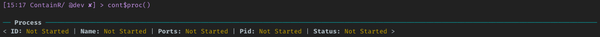
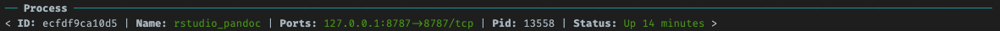

<!-- README.md is generated from README.Rmd. Please edit that file -->

```{r, include = FALSE}
knitr::opts_chunk$set(
  collapse = TRUE,
  comment = "#>",
  fig.path = "man/figures/README-",
  out.width = "100%"
)
```

# ContainR 

<!-- badges: start -->
[](https://github.com/psychtek/ContainR/actions/workflows/R-CMD-check.yaml)
[](https://lifecycle.r-lib.org/articles/stages.html#experimental)
<!-- badges: end -->

## Overview

The key problems to irreproducibility of data in research is missing *documentation*, *version control* and *containerization*. `ContainR` seeks to address these issues by making it easier to create the environment for a R project.

The package ports the pre-built [rocker-versioned](https://github.com/rocker-org/rocker-versioned2) Rstudio stacks and basic [Docker](https://docs.docker.com/reference/) commands to R. Based on the active working Rstudio project, it allows the user to create a Dockerfile and build a Docker image with Rstudio. Additional settings to include CRAN packages, Github packages, include Python, Julia, jupyter, Pandoc etc. and launch Rstudio container in a browser. 

**Outputs**

Once the image has baked any additional packages into the base Rocker stack, the Dockerfile can be saved for distribution and the image pushed to [DockerHub](https://hub.docker.com/). When a **ContainR session** is launched, your local config settings can also *cloned* into the session for previewing before hard coding the package directory into the Docker image.

The completed `containr/` folder is created with a `Dockerfile`, a tar of the package, a `scripts/install_additional.sh` file and an optional JSON file containing the Docker recipe to build the image. The image can be pushed to Dockerhub and the `containr/` file can be version controlled and/or shared with collaborators. 

```{r echo=FALSE, message=FALSE, warning=FALSE}
fs::dir_tree("containr")
```


It is currently a work in progress and welcome any [issues and comments](https://github.com/psychtek/ContainR/issues). 

[Read more about the Rocker Project](https://rocker-project.org/)


### System Requirements

[Docker](https://docker-docs.netlify.app/install/) is required for the use of this package currently support only `R (>= 4.0.0)` base images. 

### Installation

You can install the development version of `ContainR` from [GitHub](https://github.com/psychtek/ContainR) with:

``` r
# install.packages("devtools")
devtools::install_github("psychtek/ContainR")
```

#### Docker Check 

Check if Docker is installed on the system or visit install instructions for [OSX](https://docs.docker.com/desktop/install/mac-install/), [Windows](https://docs.docker.com/desktop/install/windows-install/) or [Linux](https://docs.docker.com/engine/install/):

```r
containr::docker_check()
```

### Rocker-Versioned Images

Supported [rocker-versioned](https://github.com/rocker-org/rocker-versioned2) stacks can be found by exploring the `data_rocker_table` inside the package or visiting their [repository](https://github.com/rocker-org/rocker-versioned2) to learn more. 

```{r echo=TRUE, message=FALSE, warning=FALSE}
library(containr)

data_rocker_table |> dplyr::select(-base_image)
```

## Workflow Basics

- Open your current working Rstudio project. 
- Explore which base [Rocker image](https://rocker-project.org/) to use `containr::data_rocker_table`.
- **Create** a Dockerfile `containr$new()`.
- **Build** a container `build_image(TRUE)`.
- **Run** the container `start()`.
- **Launch** the session in a browser `launch()`.
- **Stop** the container `stop()`

#### Create a Dockerfile 

For example, to create a Dockerfile based on the latest Rocker Rstudio and install packages that are loaded into the local session, add python support and install the active project from `CMD CHECK` archive: 

```r
containr <- containr$new(image = "rstudio", name = "project_name", 
packages = "loaded", copy = TRUE, include_python = TRUE)
```

The return process from this function results in the creation of a `docker/Dockerfile` build recipe with additional scripts in the `docker/scripts/` directory. If any packages require install from Github, the function takes note of these and attempts to add them to the install file as well. Any packages already installed on the base Rocker image will be skipped. 


#### View Preferences 

At any point you can check and change what was initialized. This will clear the `docker` folder and re-write the folder and scripts according to your preferences. Calling the `print()` will give you sanity checks for your preferences and the **Status** will update automatically. 


The `proc()` will display the Docker background process: 



#### Build a ContainR

Setting the `build_image(TRUE)` flag will then read the newly created `Dockerfile` and build the image based on the previous user requirements. This is saved to the local Docker register and images can be view with the `docker_images()` function.


> Note that this can take some time depending on your install preferences. 

#### Start
When this finished building the image is now ready to be started. The `start()` fun will launch the container in a background process and if we run the `proc()` command we see that it is up and running. 



#### Launch 

Running `launch()` will open a the session in a new browser window. 

#### Stop

Running `stop()` will stop the container session completely leaving the image built intact. 

## Docker Functions

Basic Docker functions are also included and additional functionality for the Docker CLI will be added as development continues. These return tibbles to the console instead of the terminal. Currently included are four functions: 

- `docker_check()`: Check if Docker is installed and running.

```{r echo=TRUE, message=TRUE, warning=TRUE}
containr::docker_check()
```

- `docker_images()`: returns a tibble of built images.

```{r echo=TRUE, message=TRUE, warning=TRUE}
containr::docker_images()
```

- `docker_containers()`: Returns a tibble of active containers. 

```{r echo=TRUE, message=TRUE, warning=TRUE}
containr::docker_containers() |> dplyr::select(Command, CreatedAt, Image, Names, Ports, Status)
```

- `docker_search("rstudio")`: Returns a tibble of search results. 

```{r echo=TRUE, message=TRUE, warning=TRUE}
containr::docker_search("rocker")
```


----

There are similar packages available such as: 
[dockr](https://github.com/smaakage85/dockr), 
[devindocker](https://github.com/ThinkR-open/devindocker), 
[harbor](https://github.com/wch/harbor)
[containerit](https://github.com/o2r-project/containerit) and 
[stevedore](https://github.com/richfitz/stevedore) which provide various levels of functionality. We also recommend checking these out to see if these address your requirements. 

### References 

- The team at [rocker-versioned](https://github.com/rocker-org/rocker-versioned2)
- [repliCATS Data Management Team](https://replicats.research.unimelb.edu.au/) 
