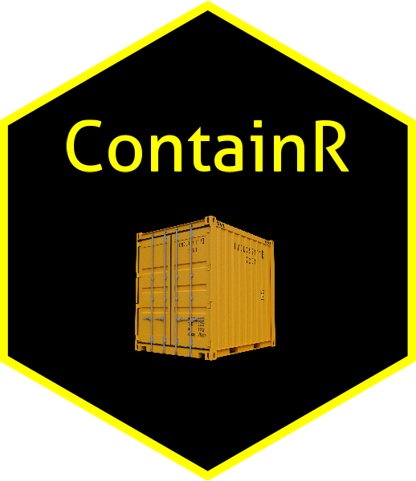
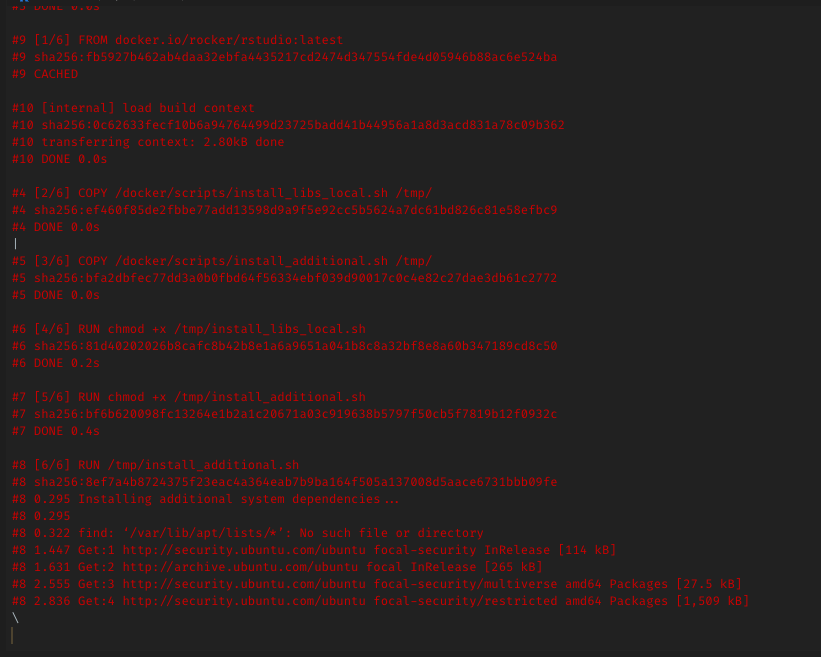

<!-- README.md is generated from README.Rmd. Please edit that file -->

# ContainR 

<!-- badges: start -->

[](https://github.com/psychtek/ContainR/actions/workflows/R-CMD-check.yaml)
[](https://lifecycle.r-lib.org/articles/stages.html#experimental)
<!-- badges: end -->

A set of functions that I found handy during the development of the
[repliCATS pipeline](https://replicats.research.unimelb.edu.au/) that
I’ve ported into this package.

## Overview

The goal of **ContainR** is to enable easier container development for
computational reproducibility. The package ports the
[rocker-versioned](https://github.com/rocker-org/rocker-versioned2)
Rstudio stacks and basic [Docker](https://docs.docker.com/reference/)
commands to R. Based on whatever Rstudio project is currently active, it
allows the user to create a Dockerfile with choices to include attached
CRAN packages (including Github packages), include Python (Pandas and
Numpy) and launch the Rstudio container in a browser.

When a **ContainR session** is launched, your local config settings can
also *cloned* into the session. R environment secrets are also available
for access during the session. These aren’t stored permanently on the
image however, allow the user to work freely with their custom layout
and reference any `.Renviron` settings - separating the development from
the private user settings.

It is currently a work in progress and welcome any [issues and
comments](https://github.com/psychtek/ContainR/issues).

[Read more about the Rocker Project](https://rocker-project.org/)

## Installation

You can install the development version of `ContainR` from
[GitHub](https://github.com/) with:

``` r
# install.packages("devtools")
devtools::install_github("psychtek/ContainR")
```

## Quick Launch

> Run the `rocker_run()` function which will launch the
> `rocker/rstudio:latest` stack into a Docker container, port **local
> config** and **environment** settings into the container and activate
> your current activates the Rstudio project in a virtual session.

Supported
[rocker-versioned](https://github.com/rocker-org/rocker-versioned2)
stacks can be found by exploring the `data_rocker_table` inside the
package or visiting their
[repository](https://github.com/rocker-org/rocker-versioned2) to learn
more.

    #> # A tibble: 5 × 4
    #>   name       image             base_image        description                    
    #>   <chr>      <chr>             <chr>             <chr>                          
    #> 1 rstudio    rocker/rstudio    rocker/r-ver      Rstudio Server                 
    #> 2 tidyverse  rocker/tidyverse  rocker/rstudio    Adds tidyverse packages & devt…
    #> 3 verse      rocker/verse      rocker/tidyverse  Adds tex & publishing-related …
    #> 4 geospatial rocker/geospatial rocker/verse      Adds geospatial packages       
    #> 5 binder     rocker/binder     rocker/geospatial Adds requirements to run repos…

### Docker Check

Check if Docker is installed on the system or visit install instructions
for [OSX](https://docs.docker.com/desktop/install/mac-install/),
[Windows](https://docs.docker.com/desktop/install/windows-install/) or
[Linux](https://docs.docker.com/engine/install/):

``` r
docker_check()
```

### Run R Project in Rocker Rstudio Container

The `rocker_run()` function will launch the latest version of
(`rocker/rstudio:latest`) from the
[rocker-versioned](https://github.com/rocker-org/rocker-versioned2)
stack.

``` r
rocker_run()
```

Alternatively, a version can be specified in the `tag` argument. To view
the images and specified tags visit the [Rocker-Versioned
Wiki](https://github.com/rocker-org/rocker-versioned2/wiki). If the
image is not found locally
(`Unable to find image 'rocker/rstudio:4.0.0' locally`) it will proceed
to grab the image from DockerHub.

``` r
rocker_run(image = "rocker/rstudio", tag = "4.0.0")
```

## Workflow Basics

- Open your current working Rstudio project.
- Explore which base [Rocker image](https://rocker-project.org/) to use
  `ContainR::data_rocker_table`.
- **Create** a Dockerfile `docker_file()`.
- **Build** a container `docker_build()`.
- **Run** the container (Launches browser) `rocker_run()`.
- **Stop** the container \`rocker_stop()\`\`

### Usage

The `docker_file()` function is an attempt to make it easier to create a
`Dockerfile` by allowing the user to:

1)  choose the appropriate Rocker base image (defaults to latest
    Rstudio);

2)  install either your local `loaded`, `installed` or `none` packages;

3)  specify which version (tag);

4)  and choose to included python (pandas and numpy).

#### Create a Dockerfile

For example, to create a Dockerfile based on the latest Rocker Rstudio,
install attached packages and include python:

``` r
docker_file(dockerfile = "inst/dockerfiles/Dockerfile",
                        which_pkgs = "loaded",
                        name = "rstudio",
                        tag = NULL,
                        include_python = TRUE)
```

The return process from this function results in the creation of a
`inst/dockerfiles/Dockerfile` which contains the Docker instructions to
build an image. If you have any packages that are on Github then, the
function will take note of these and attempt to add them to the install
file as well. Any packages already installed on the base Rocker image
will be skipped.

#### Build a Rocker Container

The `docker_build()` function will then read the newly created
`Dockerfile` and build the image based on the previous user
requirements. This is saved to the local Docker register and images can
be view with the `docker_images()` function.

``` r
docker_build(dockerfile =  "inst/dockerfiles/Dockerfile", name = "user/imagename")
```



#### Run a Rocker Container

Finally,`rocker_run()` can then be used (with the user supplied Docker
image) to launch a Rstudio container in the browser, activating the
current working project. Packages provided in the
`which_pkgs = c("loaded", "installed", "none")` argument preference
should be available.

``` r
rocker_run(image = "user/imagename")
```

------------------------------------------------------------------------

There are similar packages available such as
[dockr](https://github.com/smaakage85/dockr) or
[devindocker](https://github.com/ThinkR-open/devindocker) which provide
various levels of functionality. We also recommend checking these out to
see if these address your requirements.

### References

**ContainR** was created using the following amazing packages and
developers:

The team at Rocker-Versioned
