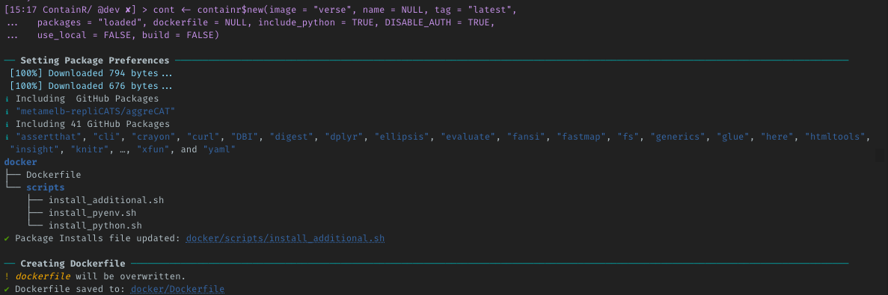
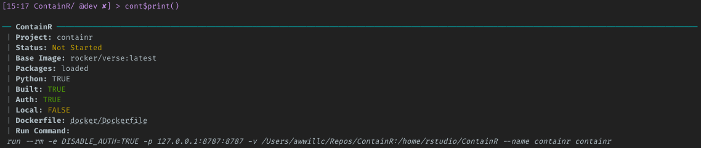
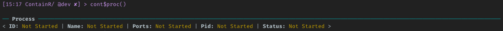
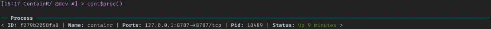
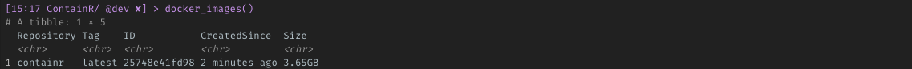

<!-- README.md is generated from README.Rmd. Please edit that file -->

# ContainR 

<!-- badges: start -->

[](https://github.com/psychtek/ContainR/actions/workflows/R-CMD-check.yaml)
[](https://lifecycle.r-lib.org/articles/stages.html#experimental)
<!-- badges: end -->

A set of functions that I found handy during the development of the
[repliCATS pipeline](https://replicats.research.unimelb.edu.au/) that
I’ve ported into this package. The key problems to irreproducibility of
data in research is missing *documentation*, *version control* and
*containerization*. `ContainR` seeks to address the container issue by
making it easier to develop the environment for a R project.

## Overview

The package ports the
[rocker-versioned](https://github.com/rocker-org/rocker-versioned2)
Rstudio stacks and basic [Docker](https://docs.docker.com/reference/)
commands to R. Based on whatever Rstudio project is currently active, it
allows the user to create a Dockerfile with choices to include attached
CRAN packages (including Github packages), include Python (Pandas and
Numpy) and launch the Rstudio container in a browser.

Once the image has baked any additional packages into the base Rocker
stack the dockerfile and scripts can be saved for distribution and the
image pushed to [DockerHub](https://hub.docker.com/). When a **ContainR
session** is launched, your local config settings can also *cloned* into
the session. R environment secrets are also available for access during
the session.

It is currently a work in progress and welcome any [issues and
comments](https://github.com/psychtek/ContainR/issues).

[Read more about the Rocker Project](https://rocker-project.org/)

### System Requirements

[Docker](https://docker-docs.netlify.app/install/) is required for the
use of this package with support only tested for `R (>= 4.0.0)` base
images.

#### Docker Check

Check if Docker is installed on the system or visit install instructions
for [OSX](https://docs.docker.com/desktop/install/mac-install/),
[Windows](https://docs.docker.com/desktop/install/windows-install/) or
[Linux](https://docs.docker.com/engine/install/):

``` r
docker_check()
```

### Installation

You can install the development version of `ContainR` from
[GitHub](https://github.com/psychtek/ContainR) with:

``` r
# install.packages("devtools")
devtools::install_github("psychtek/ContainR")
```

### Rocker-Versioned Images

Supported
[rocker-versioned](https://github.com/rocker-org/rocker-versioned2)
stacks can be found by exploring the `data_rocker_table` inside the
package or visiting their
[repository](https://github.com/rocker-org/rocker-versioned2) to learn
more.

``` r
library(containr)

data_rocker_table |> dplyr::select(-base_image)
#> # A tibble: 5 × 3
#>   name       image             description                                   
#>   <chr>      <chr>             <chr>                                         
#> 1 rstudio    rocker/rstudio    Rstudio Server                                
#> 2 tidyverse  rocker/tidyverse  Adds tidyverse packages & devtools            
#> 3 verse      rocker/verse      Adds tex & publishing-related package         
#> 4 geospatial rocker/geospatial Adds geospatial packages                      
#> 5 binder     rocker/binder     Adds requirements to run repos on mybinder.org
```

## Workflow Basics

- Open your current working Rstudio project.
- Explore which base [Rocker image](https://rocker-project.org/) to use
  `containr::data_rocker_table`.
- **Create** a Dockerfile `containr$new()`.
- **Build** a container `build_image(TRUE)`.
- **Run** the container (Launches browser) `start()`.
- **Stop** the container `stop()`

#### Create a Dockerfile

For example, to create a Dockerfile based on the latest Rocker Rstudio
and install whatever packages are loaded into the local session:

``` r
containr <- containr$new(image = "rstudio", name = "containr", tag = "latest", 
  packages = "loaded", include_python = FALSE, DISABLE_AUTH = TRUE, 
  use_local = FALSE)
```

The return process from this function results in the creation of a
`docker/Dockerfile` with additional scripts in the `docker/scripts/`
directory. If any packages require install from Github, the function
take note of these and attempt to add them to the install file as well.
Any packages already installed on the base Rocker image will be skipped.



#### View Preferences

At any point you can check and change what was initialized. This will
clear the `docker` folder and re-write the folder and scripts according
to your preferences. Calling the `print()` will give you sanity checks
for your preferences and the **Status** will update automatically.



The `proc()` will display the running container which at this point, we
have nothing built or running:



#### Build a ContainR

Setting the `build_image(TRUE)` flag will then read the newly created
`Dockerfile` and build the image based on the previous user
requirements. This is saved to the local Docker register and images can
be view with the `docker_images()` function.


> Note that this can take some time depending on your install
> preferences.

#### Start

When this finished building the image is now ready to be started. The
`start()` fun will launch the container in a background process but if
we run the `proc()` then we can see that it is up and running.



You can run the `docker_images()` to view the Docker register of built
images.



#### Launch

Running `launch()` will open a the session in a new browser window.

#### Stop

Running `stop()` will stop the container session completely leaving the
image built intact.

## Docker Wrapper & Other Info

A basic docker wrapper is also included that will build functionality as
development continues. Like the `containr` object, this is also a
[R6](https://github.com/r-lib/R6) class object. Included are three
functions:

- `docker_images()`: returns a tibble of built images. Equivalent
  terminal command is `docker image ls` but it was difficult to work
  with the terminal output so this now makes things easier to work
  within R environment.

- `docker_containers()`: Returns a tibble of active containers.
  Equivalent terminal command is `docker container ls`.

To run a docker command you can do it direct:

``` r
containr::docker$new(process = "docker",
    commands = "image",
    options = "ls")$show_output()
#> # A tibble: 5 × 5
#>   Repository                Tag    ID           CreatedSince  Size  
#>   <chr>                     <chr>  <chr>        <chr>         <chr> 
#> 1 testing                   latest 109adc46fa7d 5 days ago    1.86GB
#> 2 rocker/r-base             latest 8b9043f755f1 5 days ago    863MB 
#> 3 rstudio-rock              latest 43333a2e7a4c 5 days ago    1.87GB
#> 4 <none>                    <none> fff24ba7fdba 5 days ago    1.87GB
#> 5 romancin/tinymediamanager latest 42880c846cf2 11 months ago 261MB
```

or with the included functions:

``` r
containr::docker_images()
#> # A tibble: 5 × 5
#>   Repository                Tag    ID           CreatedSince  Size  
#>   <chr>                     <chr>  <chr>        <chr>         <chr> 
#> 1 testing                   latest 109adc46fa7d 5 days ago    1.86GB
#> 2 rocker/r-base             latest 8b9043f755f1 5 days ago    863MB 
#> 3 rstudio-rock              latest 43333a2e7a4c 5 days ago    1.87GB
#> 4 <none>                    <none> fff24ba7fdba 5 days ago    1.87GB
#> 5 romancin/tinymediamanager latest 42880c846cf2 11 months ago 261MB
```

Search dockerhub for images:

``` r
containr::docker_search("rocker")
#> # A tibble: 25 × 5
#>    Name               Description                        StarC…¹ IsOff…² IsAut…³
#>    <chr>              <chr>                                <int> <lgl>   <chr>  
#>  1 rocker/rstudio     "RStudio Server image"                 399 NA      [OK]   
#>  2 rocker/shiny       ""                                     172 NA      [OK]   
#>  3 rocker/tidyverse   "Version-stable build of R, rstud…     157 NA      [OK]   
#>  4 rocker/r-base      "Basic R for Rocker And Official …      80 NA      [OK]   
#>  5 rocker/verse       "Adds tex & related publishing pa…      64 NA      [OK]   
#>  6 rocker/r-ver       "Reproducible builds to fixed ver…      49 NA      [OK]   
#>  7 rocker/geospatial  "Docker-based Geospatial toolkit …      44 NA      [OK]   
#>  8 rocker/shiny-verse "Rocker Shiny image + Tidyverse R…      44 NA      [OK]   
#>  9 rocker/ropensci    ""                                      22 NA      [OK]   
#> 10 rocker/r-devel     ""                                      22 NA      [OK]   
#> # … with 15 more rows, and abbreviated variable names ¹​StarCount, ²​IsOfficial,
#> #   ³​IsAutomated
```

> Note that tibble output has only been included for the `image`,
> `container` and `search` commands for now. This will be expanded over
> the course of development and value any comments or feedback.

------------------------------------------------------------------------

There are similar packages available such as:
[dockr](https://github.com/smaakage85/dockr),
[devindocker](https://github.com/ThinkR-open/devindocker),
[harbor](https://github.com/wch/harbor)
[containerit](https://github.com/o2r-project/containerit) and
[stevedore](https://github.com/richfitz/stevedore) which provide various
levels of functionality. We also recommend checking these out to see if
these address your requirements.

### References

- The team at
  [rocker-versioned](https://github.com/rocker-org/rocker-versioned2)
- [repliCATS Data Management
  Team](https://replicats.research.unimelb.edu.au/)
