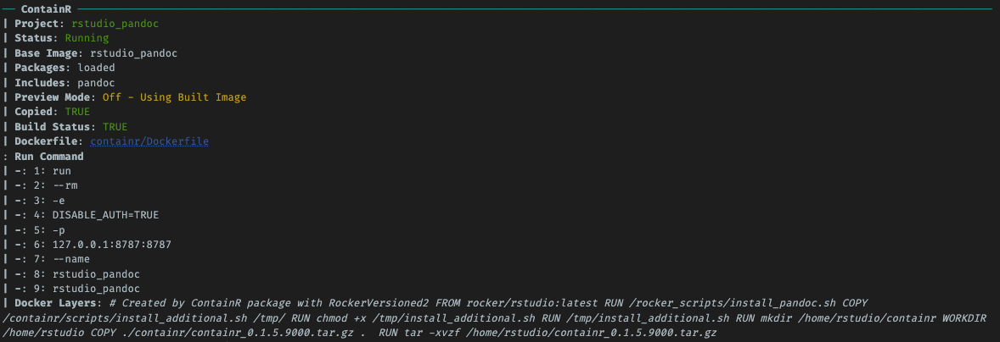

<!-- README.md is generated from README.Rmd. Please edit that file -->

# ContainR 

<!-- badges: start -->

[](https://github.com/psychtek/ContainR/actions/workflows/R-CMD-check.yaml)
[](https://lifecycle.r-lib.org/articles/stages.html#experimental)
<!-- badges: end -->

A set of functions that I found handy during the development of the
[repliCATS pipeline](https://replicats.research.unimelb.edu.au/) that
I’ve ported into this package.

## Overview

The goal of **ContainR** is to enable easier container development for
computational reproducibility. The package ports the
[rocker-versioned](https://github.com/rocker-org/rocker-versioned2)
Rstudio stacks and basic [Docker](https://docs.docker.com/reference/)
commands to R. Based on whatever Rstudio project is currently active, it
allows the user to create a Dockerfile with choices to include attached
CRAN packages (including Github packages), include Python (Pandas and
Numpy) and launch the Rstudio container in a browser.

When a **ContainR session** is launched, your local config settings can
also *cloned* into the session. R environment secrets are also available
for access during the session. These aren’t stored permanently on the
image however, allow the user to work freely with their custom layout
and reference any `.Renviron` settings - separating the development from
the private user settings.

It is currently a work in progress and welcome any [issues and
comments](https://github.com/psychtek/ContainR/issues).

[Read more about the Rocker Project](https://rocker-project.org/)

## Installation

You can install the development version of `ContainR` from
[GitHub](https://github.com/) with:

``` r
# install.packages("devtools")
devtools::install_github("psychtek/ContainR")
```

Supported
[rocker-versioned](https://github.com/rocker-org/rocker-versioned2)
stacks can be found by exploring the `data_rocker_table` inside the
package or visiting their
[repository](https://github.com/rocker-org/rocker-versioned2) to learn
more.

    #>         name             image        base_image
    #> 1    rstudio    rocker/rstudio      rocker/r-ver
    #> 2  tidyverse  rocker/tidyverse    rocker/rstudio
    #> 3      verse      rocker/verse  rocker/tidyverse
    #> 4 geospatial rocker/geospatial      rocker/verse
    #> 5     binder     rocker/binder rocker/geospatial
    #>                                      description
    #> 1                                 Rstudio Server
    #> 2             Adds tidyverse packages & devtools
    #> 3          Adds tex & publishing-related package
    #> 4                       Adds geospatial packages
    #> 5 Adds requirements to run repos on mybinder.org

### Docker Check

Check if Docker is installed on the system or visit install instructions
for [OSX](https://docs.docker.com/desktop/install/mac-install/),
[Windows](https://docs.docker.com/desktop/install/windows-install/) or
[Linux](https://docs.docker.com/engine/install/):

``` r
docker_check()
```

## Workflow Basics

- Open your current working Rstudio project.
- Explore which base [Rocker image](https://rocker-project.org/) to use
  `containr::data_rocker_table`.
- **Create** a Dockerfile `containr$new)`.
- **Build** a container `build_image(TRUE)`.
- **Run** the container (Launches browser) `start()`.
- **Stop** the container `stop()`

### Usage

1)  choose the appropriate Rocker base image (defaults to latest
    `rocker/rstudio:latest`);

2)  install either your local `loaded`, `installed` or `none` packages;

3)  and choose to included python.

#### Create a Dockerfile

For example, to create a Dockerfile based on the latest Rocker Rstudio
and install whatever packages are loaded into the local session:

``` r
containr <- containr$new(image = "rstudio", name = "containr", tag = "latest", 
  packages = "loaded", include_python = FALSE, DISABLE_AUTH = TRUE, 
  use_local = FALSE)
```

The return process from this function results in the creation of a
`docker/Dockerfile` which contains the Docker instructions to build an
image. If you have any packages that are on Github then, the function
will take note of these and attempt to add them to the install file as
well. Any packages already installed on the base Rocker image will be
skipped.


#### View Preferences

At any point you can check and change what was initialized. This will
clear the `docker` folder and re-write the folder and scripts according
to your preferences. Calling the `print()` will give you sanity checks
for your preferences and the **Status** will update automatically.



The `proc()` will display the running container which at this point we
have nothing built or running:


#### Build a ContainR

Setting the `build_image(TRUE)` flag will then read the newly created
`Dockerfile` and build the image based on the previous user
requirements. This is saved to the local Docker register and images can
be view with the `docker_images()` function.


> Note that this can take some time depending on your install
> preferences.

#### Start

When this finished building the image is now ready to be started. The
`start()` fun will launch the container in a background process but if
we run the `proc()` then we can see that it is up and running.


You can run the `docker_images()` to view the docker registery of built
images.


### Launch

Running `launch()` will open a the session in a new browser window.

### Stop

Running `stop()` will stop the container session completely leaving the
image built intact.

------------------------------------------------------------------------

There are similar packages available such as
[dockr](https://github.com/smaakage85/dockr) or
[devindocker](https://github.com/ThinkR-open/devindocker) which provide
various levels of functionality. We also recommend checking these out to
see if these address your requirements.

### References

**ContainR** was created using the following amazing packages and
developers:

The team at Rocker-Versioned
